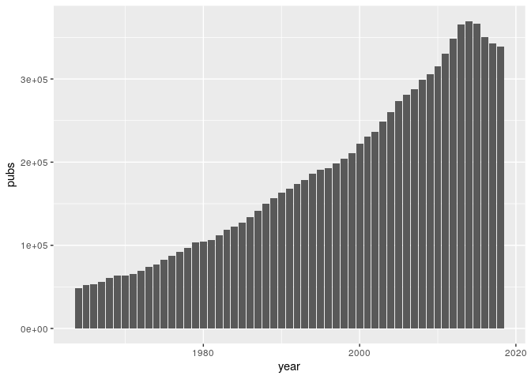
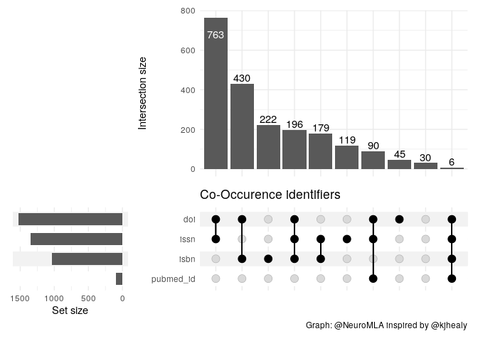
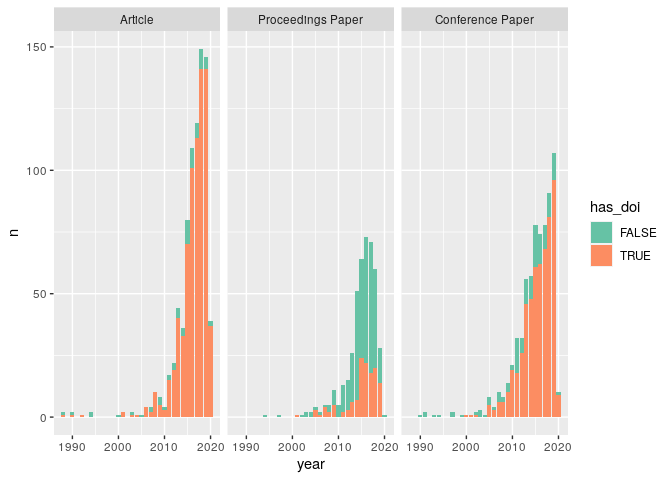
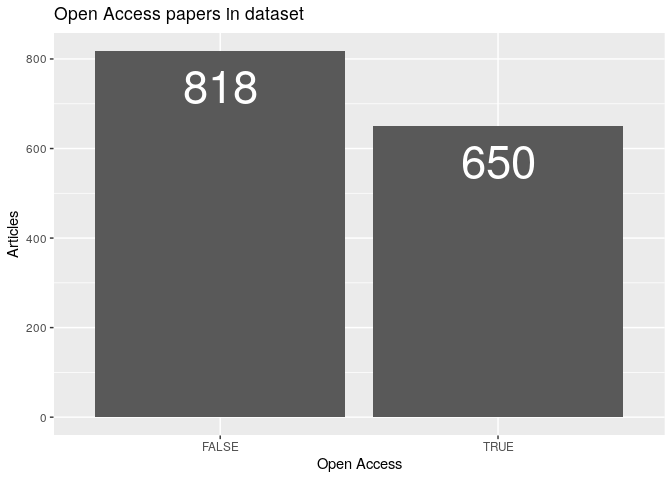
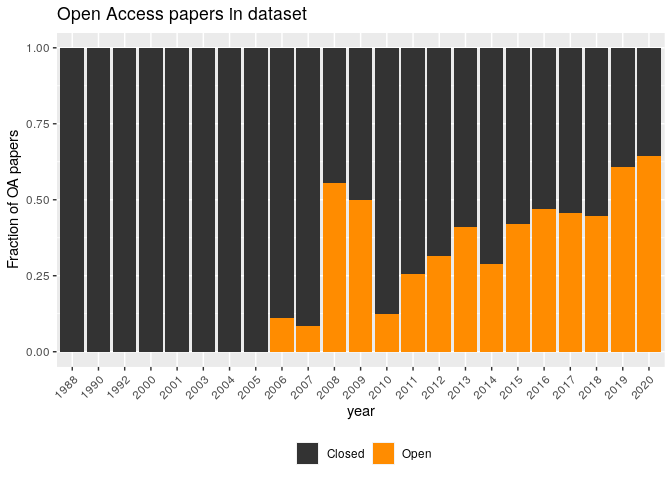
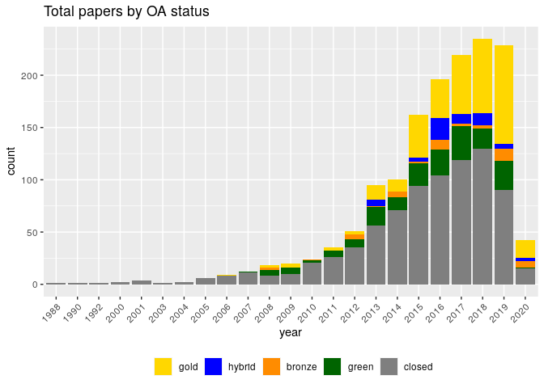

Paper database analysis
================
Matias Andina
2020-06-23

``` r
# wrangling and viz
library(tidyverse)
# install.packages("roadoi")
# unpaywall api
library(roadoi)

# Read paper data from github
df <- read_csv("https://raw.githubusercontent.com/amchagas/open-hardware-supply/master/data/allData.csv")
```

### Papers by language

``` r
df %>% 
  count(language, sort=TRUE) %>%
  mutate(language = fct_reorder(language,
                                n))%>%
  ggplot(aes(language, n)) +
  geom_col() + coord_flip()+
  ggtitle("Number of papers by language")
```

<!-- -->
\#\#\# Papers by year

This plot is useful. However, all papers show this trend. To make the
case that open source hardware is increasing, we should see it increase
at a faster rate than the publication increse.

``` r
df %>% 
  count(year, sort=TRUE) %>%
  ggplot(aes(year, n)) +
  geom_col() + 
  ggtitle("Number of papers by year")
```

<!-- -->

``` r
web <- xml2::read_html("https://www.nlm.nih.gov/bsd/medline_cit_counts_yr_pub.html")
tables<-rvest::html_nodes(web, "table")
pubmed <- rvest::html_table(tables[[1]], fill = TRUE)
pubmed %>%
  select(year=`Year of Publication`, pubs=`# Citations Published in US`) %>%
  mutate_all(parse_number) %>%
  # 2019 is incomplete
  filter(year < 2019) %>% 
  # there is some parsing errors because aggregation of data (we keep the last 55 years)
  slice(1:55) -> pubmed

ggplot(pubmed, aes(year, pubs))+
  geom_col()
```

<!-- -->

Although this is only Pubmed base, some good news :)

``` r
pubmed %>% 
left_join(df %>% 
  count(year, sort=TRUE)) %>%
  ggplot(aes(year, n/pubs))+
  geom_col() +
  scale_y_continuous(labels = scales::percent_format(accuracy = 0.001)) +
  labs(title = "Share of OSH papers",
       subtitle = "Total publications come from PubMed.\nResults might vary when adding other databases.",
       y="Fraction of papers")
```

<!-- -->

### Data is incomplete

``` r
#devtools::install_github("krassowski/complex-upset")
library(ComplexUpset)
df %>%
  mutate(doi = !is.na(doi),
        pubmed_id = !is.na(pubmed_id),
        issn = !is.na(issn),
        isbn = !is.na(isbn)) %>% 
  select(doi, pubmed_id, issn, isbn) -> sum_available

sets = names(sum_available)
upset(sum_available, intersect=sets, min_size=0, name="")+
  labs(title = "Co-Occurence identifiers",
       caption = "Graph: @NeuroMLA inspired by @kjhealy")
```

<!-- -->

Most of the database is Articles, Proceeding Papers, and Conference
papers. Total number of papers in the dataset is \~2080

``` r
df %>% 
  group_by(type) %>%
  count(sort = TRUE)
```

    ## # A tibble: 20 x 2
    ## # Groups:   type [20]
    ##    type                           n
    ##    <chr>                      <int>
    ##  1 Article                      805
    ##  2 Conference Paper             696
    ##  3 Proceedings Paper            442
    ##  4 Conference Review             29
    ##  5 Review                        25
    ##  6 Book Chapter                  20
    ##  7 Article; Proceedings Paper    12
    ##  8 Editorial Material             9
    ##  9 Meeting Abstract               9
    ## 10 Note                           7
    ## 11 Short Survey                   5
    ## 12 Book                           4
    ## 13 Editorial                      4
    ## 14 Letter                         4
    ## 15 News Item                      3
    ## 16 Article; Book Chapter          2
    ## 17 Correction                     1
    ## 18 Erratum                        1
    ## 19 Record Review                  1
    ## 20 Review; Book Chapter           1

Analyzing principle types to see whether they have or not DOIs.

``` r
df %>%
  filter(type=="Article"| type=="Conference Paper"|type=="Proceedings Paper") %>% 
  mutate(has_doi = !is.na(doi)) %>%
  group_by(year, type) %>%
  count(has_doi, sort = TRUE) %>%
  ggplot(aes(year, n, fill=has_doi)) +
  geom_col() + facet_wrap(~fct_reorder(type, n))+
  scale_fill_brewer(palette="Set2")
```

<!-- -->

### Continue with only the papers that have DOIs

``` r
doi_list <- df %>% filter(!is.na(doi)) %>% pull(doi)
# safely get dois
# this has been done previously, data provided as .Rdata
#my_data <- purrr::map(doi_list, 
#  .f = purrr::safely(function(x) roadoi::oadoi_fetch(x,
#  .progress = "text",
#  email = "matiasandina@gmail.com")))
```

``` r
my_data <- readRDS("paper_database_data.Rdata")
results <- purrr::map_df(my_data, "result")

urls <-  results %>% 
  mutate(
  urls = purrr::map(best_oa_location, "url") %>% 
    purrr::map_if(purrr::is_empty, ~ NA_character_) %>% 
    purrr::flatten_chr()
) %>%
  .$urls

# explore errors (no errors, yay!)
errors <- purrr::map_df(my_data, "errors")
```

Open hardware not so open.

``` r
results %>%
  group_by(is_oa) %>%
  summarise(Articles = n()) %>%
  ggplot(aes(is_oa, Articles)) +
  geom_col()+
  geom_text(aes(y=Articles - 80, label=Articles), color="white", size=12)+
  labs(x="Open Access",
       title="Open Access papers in dataset")
```

<!-- -->

Open hardware not so open, but getting better?

``` r
# 3 pubs have no year? that needs a manual fix perhaps?
results <- filter(results, !is.na(year))

total_pubs_per_year <- results %>%
  group_by(year) %>%
  summarise(pubs = n())

results %>%
  group_by(year, is_oa) %>%
  summarise(Articles = n()) %>%
  left_join(total_pubs_per_year) %>%
  mutate(is_oa = ifelse(is_oa, "Open", "Closed")) %>% 
  ggplot(aes(year, Articles/pubs, fill=is_oa)) +
  geom_col()+
  scale_fill_manual(values=c("gray20", "darkorange"))+
  theme(legend.position = "bottom", legend.title = element_blank(),
        axis.text.x = element_text(angle = 45, hjust=1))+
  labs(title = "Open Access papers in dataset",
       y= "Fraction of OA papers")
```

<!-- -->

#### Open Access status

``` r
results %>%
  mutate(oa_status = fct_relevel(oa_status,
                                 levels=c("gold", "hybrid", "bronze", "green", "closed"))) %>% 
  ggplot(aes(year, fill=oa_status)) +
  geom_bar()+
  scale_fill_manual(values = c("gold", "blue", "darkorange", "darkgreen", "gray50"))+
  theme(legend.position = "bottom", legend.title = element_blank(),
        axis.text.x = element_text(angle = 45, hjust=1))+
  labs(title="Total papers by OA status")
```

<!-- -->

``` r
results %>% count(publisher, sort=TRUE) 
```

    ## # A tibble: 112 x 2
    ##    publisher                                                    n
    ##    <chr>                                                    <int>
    ##  1 IEEE                                                       398
    ##  2 Elsevier BV                                                192
    ##  3 MDPI AG                                                    117
    ##  4 Institute of Electrical and Electronics Engineers (IEEE)   109
    ##  5 Springer Science and Business Media LLC                     73
    ##  6 ACM Press                                                   62
    ##  7 Springer International Publishing                           53
    ##  8 Wiley                                                       35
    ##  9 IOP Publishing                                              32
    ## 10 SPIE                                                        26
    ## # … with 102 more rows

Most of the research is published in journals that are not open access.

``` r
results %>%
  count(journal_is_oa)
```

    ## # A tibble: 2 x 2
    ##   journal_is_oa     n
    ##   <lgl>         <int>
    ## 1 FALSE          1110
    ## 2 TRUE            355
